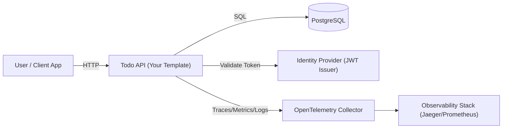
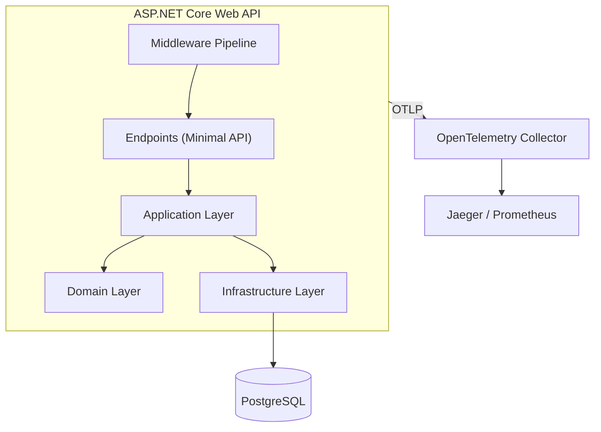
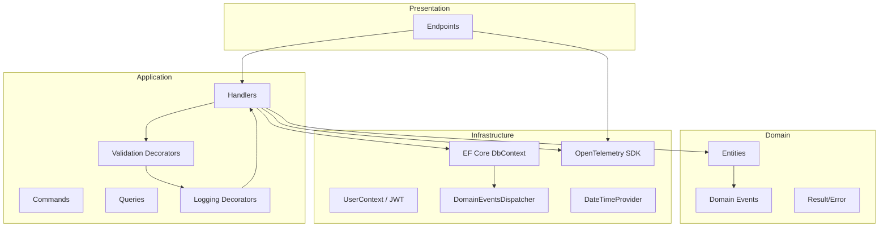
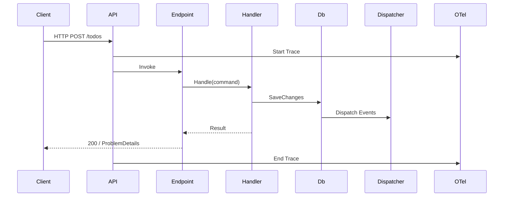
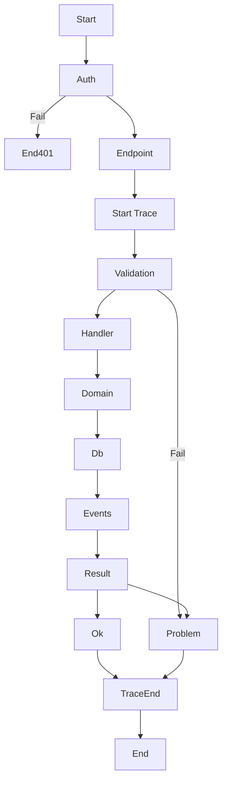

# 🧩 C4 — Context Diagram (Mermaid)

Shows your system in the world.



**Interpretation (critical):**
You are not building “just an API”, you are building:

> A **boundary system** between users, identity, persistence, and observability.

---

# 🧱 C4 — Container Diagram (Mermaid)

Shows internal deployable units.



Critical view:

* Domain is **inside** container
* Infrastructure is **pluggable**
* Telemetry is **out-of-process**

---

# 🧩 C4 — Component Diagram (Mermaid)

Now inside your API.



This diagram shows:
✔ Application pipeline
✔ Domain purity
✔ Telemetry as cross-cutting
✔ Dispatcher tied to DbContext

---

# 🔁 Sequence Diagram (with OpenTelemetry)



Truth check:

* Telemetry does NOT belong only to middleware
* It spans **HTTP + DB + domain events**

---

# 🌱 Flow Diagram (with OpenTelemetry)



---

# Clean Architecture Web API Template (.NET 10)

This project is a production-ready template for building Web APIs using:

- Clean Architecture
- CQRS-style Commands & Queries
- Result Pattern (no exceptions for flow control)
- FluentValidation
- Domain Events
- OpenTelemetry
- JWT Authentication & Authorization
- EF Core with PostgreSQL

## Architecture Overview

The solution follows Clean Architecture:

- **Presentation**: Endpoints, middleware, OpenAPI
- **Application**: Commands, queries, handlers, decorators
- **Domain**: Entities, domain events, errors, result pattern
- **Infrastructure**: EF Core, authentication, telemetry, time providers

Dependencies always point inward.

## Request Flow

1. HTTP request hits endpoint
2. Authentication & authorization
3. Command/Query is created
4. Validation decorator runs
5. Logging decorator runs
6. Handler executes business logic
7. EF Core persists changes
8. Domain events are dispatched
9. Result is returned
10. Telemetry is emitted

## Key Concepts

### Commands & Queries
Handlers implement:
- `ICommandHandler<T>`
- `IQueryHandler<T, TResult>`

### Result Pattern
All operations return `Result<T>` instead of throwing for business errors.

### Domain Events
Entities can raise domain events which are dispatched after `SaveChangesAsync`.

### OpenTelemetry
The API emits:
- Traces
- Metrics
- Logs

Using OTLP to an OpenTelemetry Collector.

## Tech Stack

- ASP.NET Core
- EF Core
- PostgreSQL
- FluentValidation
- OpenTelemetry
- JWT Authentication

## How to Run

```bash
dotnet run
```

Ensure connection string and JWT settings are configured.

## Why this Template Exists

To avoid re-implementing:

* Auth
* Telemetry
* Error handling
* CQRS plumbing
* Validation
* Domain events

and focus only on business logic.
