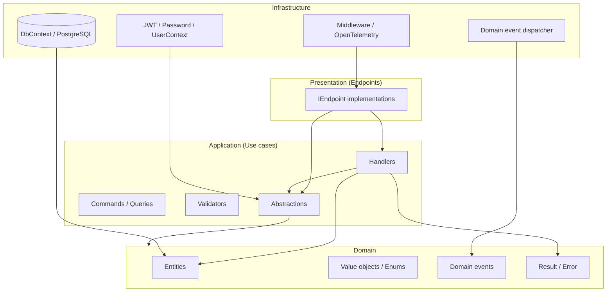
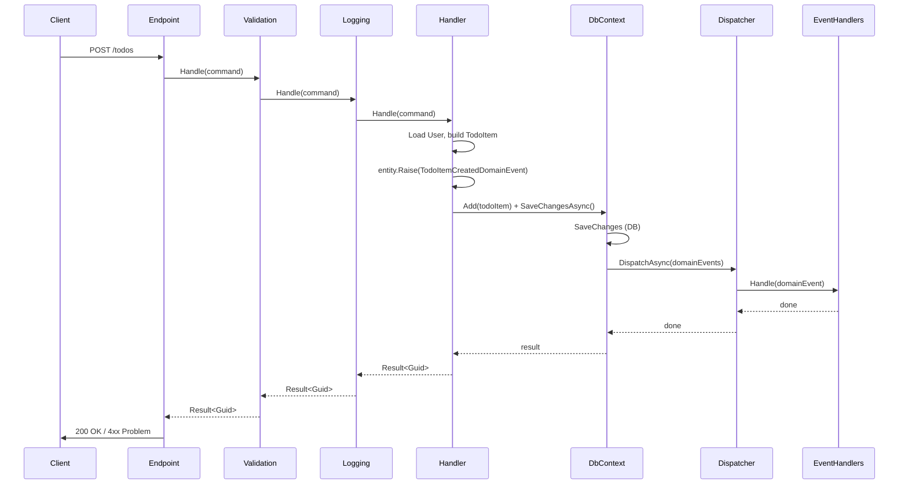
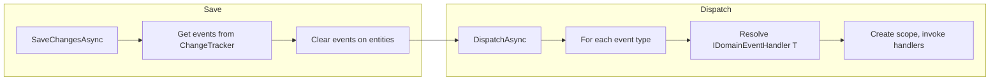

# Clean Architecture

## 1. Project Overview

This project is a **Clean Architecture** reference implementation built with .NET. It provides a **REST API** for user management and todo items, demonstrating separation of concerns, CQRS-style commands and queries, domain events, and testable architecture.

**Purpose:** Serve as a production-style template for building ASP.NET Core APIs with:

- Clear boundaries between Domain, Application, Infrastructure, and Presentation
- Command/query handlers with validation and logging decorators
- Domain events dispatched after persistence
- JWT authentication and permission-based authorization
- PostgreSQL persistence with Entity Framework Core
- Health checks and OpenTelemetry-based observability (tracing, metrics, logging)

**Problem it solves:** It shows how to structure a .NET solution so that business logic lives in a dependency-free domain, application use cases depend only on abstractions, and infrastructure (database, auth, etc.) can be swapped without affecting core behavior.

---

## 2. Tech Stack

| Category | Technology |
|----------|------------|
| **Runtime / framework** | .NET 10.0, ASP.NET Core (minimal APIs / endpoints) |
| **Language** | C# with nullable reference types and implicit usings |
| **API / docs** | OpenAPI, Scalar for API reference UI |
| **Persistence** | PostgreSQL, Entity Framework Core 10, Npgsql, snake_case naming (EFCore.NamingConventions) |
| **Validation** | FluentValidation |
| **Auth** | JWT Bearer (Microsoft.AspNetCore.Authentication.JwtBearer) |
| **DI / discovery** | Scrutor (assembly scanning for handlers and decorators) |
| **Health checks** | AspNetCore.HealthChecks.NpgSql, AspNetCore.HealthChecks.UI.Client |
| **Observability** | OpenTelemetry (tracing, metrics, logging), OTLP exporter, Npgsql instrumentation; Aspire dashboard (via Docker) |
| **Containers** | Docker, docker-compose (web API + PostgreSQL + Aspire dashboard) |
| **Task runner** | [Just](https://github.com/casey/just) (Justfile in repo root) |
| **Testing** | xUnit v3, NetArchTest.Rules (architecture tests), Shouldly, Coverlet |
| **Code quality** | SonarAnalyzer, Anv (env/config), TreatWarningsAsErrors, central package management (Directory.Packages.props) |

---

## 3. Architecture Overview

The solution follows **Clean Architecture** (and DDD-inspired patterns) with four main layers. Dependencies point inward: Presentation → Application → Domain, and Infrastructure implements Application and Domain abstractions.

- **Domain** – Entities, value objects, domain events, `Result`/`Error`, and interfaces used by the application (e.g. `IDateTimeProvider`). No dependencies on other layers or external packages (except `System`).
- **Application** – Use cases: commands, queries, handlers, validators, DTOs, and interfaces (e.g. `IApplicationDbContext`, `IUserContext`, `ITokenProvider`). Depends only on Domain and FluentValidation.
- **Infrastructure** – Implementations: EF Core DbContext, PostgreSQL, JWT auth, password hashing, domain event dispatcher, middleware, OpenTelemetry, health checks. Depends on Application and Domain.
- **Presentation** – HTTP API: endpoint classes that map routes, call command/query handlers, and return results. Depends on Application and Domain (and minimal ASP.NET Core types).

Architecture tests (see §12) enforce that Domain does not depend on Application, Infrastructure, or Presentation; Application does not depend on Infrastructure or Presentation; and Presentation does not depend on Infrastructure.



**Dependency direction:** Presentation → Application → Domain; Infrastructure → Application, Domain.

---

## 4. Project Structure

Important folders and their responsibilities:

```
clean-architecture/
├── Justfile                           # Task runner recipes (run, test, format, containers, etc.)
├── src/
│   └── App/                          # Single web application project
│       ├── App.csproj
│       ├── Program.cs                # Composition root: DI, middleware, endpoints
│       ├── AppEnv.cs                 # Environment/config (e.g. OTEL_SERVICE_NAME)
│       ├── appsettings.json
│       ├── appsettings.Development.json
│       ├── Dockerfile
│       ├── Domain/                   # Domain layer
│       │   ├── Entity.cs             # Base entity with domain events list
│       │   ├── IDomainEvent.cs
│       │   ├── IDomainEventHandler.cs
│       │   ├── IDateTimeProvider.cs
│       │   ├── Result.cs, ResultExtensions.cs
│       │   ├── Error.cs, ErrorType.cs, ValidationError.cs
│       │   ├── Users/
│       │   │   ├── User.cs
│       │   │   ├── UserErrors.cs
│       │   │   └── UserRegisteredDomainEvent.cs
│       │   └── Todos/
│       │       ├── TodoItem.cs
│       │       ├── Priority.cs
│       │       ├── TodoItemErrors.cs
│       │       ├── TodoItemCreatedDomainEvent.cs
│       │       ├── TodoItemCompletedDomainEvent.cs
│       │       └── TodoItemDeletedDomainEvent.cs
│       ├── Application/              # Application layer
│       │   ├── Abstractions/
│       │   │   ├── Messaging/        # ICommand, IQuery, ICommandHandler, IQueryHandler
│       │   │   ├── Behaviors/        # ValidationDecorator, LoggingDecorator
│       │   │   ├── Data/             # IApplicationDbContext
│       │   │   └── Authentication/   # IUserContext, ITokenProvider, IPasswordHasher
│       │   ├── Users/                # Register, Login, GetById, GetByEmail
│       │   └── Todos/                # Create, Get, GetById, Update, Delete, Complete
│       ├── Infrastructure/           # Infrastructure layer
│       │   ├── DependencyInjection.cs
│       │   ├── ApplicationDependencyInjection.cs
│       │   ├── InfrastructureDependencyInjection.cs
│       │   ├── Database/             # ApplicationDbContext, migrations, Schemas
│       │   ├── DomainEvents/         # IDomainEventsDispatcher, DomainEventsDispatcher
│       │   ├── Authentication/      # TokenProvider, PasswordHasher, UserContext
│       │   ├── Authorization/       # Permission, HasPermissionAttribute, policy provider
│       │   ├── Extensions/           # OpenTelemetry, migrations, middleware, OpenAPI
│       │   ├── Middleware/           # RequestContextLoggingMiddleware
│       │   ├── Time/                 # DateTimeProvider
│       │   └── GlobalExceptionHandler.cs
│       └── Presentation/
│           └── Endpoints/            # IEndpoint, Tags, CustomResults, Health, Users, Todos
├── tests/
│   └── App.Tests.Architecture/       # NetArchTest layer and dependency rules
├── docker-compose.yml               # web-api, postgres, aspire dashboard
├── docker-compose.override.yml
├── Directory.Build.props             # TargetFramework, analysis, SonarAnalyzer
├── Directory.Packages.props         # Central package versions
└── App.slnx                         # SDK-style solution (CI uses this)
```

- **Domain:** Core entities (`User`, `TodoItem`), domain events, `Result`/`Error`, and interfaces used by application.
- **Application:** One folder per feature (e.g. `Users`, `Todos`) with commands, queries, handlers, validators; shared abstractions under `Abstractions`.
- **Infrastructure:** All concrete implementations (EF, auth, events, middleware, health, OpenTelemetry).
- **Presentation:** Endpoint classes only; they receive HTTP input, call handlers, and map `Result` to HTTP (e.g. via `CustomResults.Problem`).

---

## 5. Request Flow

A typical request (e.g. create todo) flows as follows:

1. **HTTP** – Request hits the endpoint (e.g. `POST /todos`) mapped by an `IEndpoint` implementation.
2. **Presentation** – Endpoint builds a command (e.g. `CreateTodoCommand`) from the request body and calls `ICommandHandler<CreateTodoCommand, Guid>.Handle`.
3. **Application** – The handler is wrapped by **ValidationDecorator** (FluentValidation) then **LoggingDecorator**. The actual handler uses `IApplicationDbContext`, `IDateTimeProvider`, `IUserContext`, loads domain entities, creates a `TodoItem`, raises a domain event, adds it to the context, and calls `SaveChangesAsync`.
4. **Infrastructure** – `ApplicationDbContext.SaveChangesAsync` persists changes, then collects domain events from the change tracker, clears them from entities, and calls `IDomainEventsDispatcher.DispatchAsync`.
5. **Domain events** – The dispatcher resolves all `IDomainEventHandler<T>` for each event and runs them (e.g. side effects like sending emails).
6. **Response** – Endpoint maps `Result<Guid>` to HTTP (e.g. `Results.Ok(id)` or `CustomResults.Problem(result)`).



---

## 6. Domain Model

### Entities

- **`User`** (`App.Domain.Users`) – Id, Email, FirstName, LastName, PasswordHash. Used for authentication and as owner of todo items.
- **`TodoItem`** (`App.Domain.Todos`) – Id, UserId, Description, DueDate, Labels, IsCompleted, CreatedAt, CompletedAt, Priority. Owned by a user; supports completion and deletion.

Both inherit **`Entity`**, which holds a list of **domain events** and exposes `Raise(IDomainEvent)` and `ClearDomainEvents()`.

### Value objects / enums

- **`Priority`** (`App.Domain.Todos`) – Enum: NORMAL, LOW, MEDIUM, HIGH, TOP.

### Result and errors

- **`Result`** / **`Result<T>`** – Success/failure type used by handlers; avoids throwing for expected failures.
- **`Error`** – Code, Description, ErrorType (FAILURE, VALIDATION, PROBLEM, NOT_FOUND, CONFLICT).
- **`ValidationError`** – Subtype of `Error` carrying an array of `Error` for validation failures.
- **`UserErrors`** / **`TodoItemErrors`** – Static factory methods for domain-specific errors (e.g. NotFound, Unauthorized).

### Aggregates

The codebase does not explicitly define aggregate roots; `User` and `TodoItem` are the main entities. `TodoItem` references `UserId`; consistency is enforced in the application layer (e.g. handlers check that the current user owns the todo).

---

## 7. Domain Events

### How events are raised

- Domain events are **raised on entities** via `entity.Raise(domainEvent)` (e.g. in a command handler).
- Events are stored in the `Entity` base class list and **not** published immediately.

### When they are dispatched

- **After** `SaveChangesAsync` in `ApplicationDbContext`: the context gathers all domain events from tracked entities, clears them, then calls `IDomainEventsDispatcher.DispatchAsync(domainEvents)`. So events are dispatched in a **separate step** after the transaction commits (eventual consistency; handlers can fail independently).

### Handler discovery and dispatcher

- Handlers implement **`IDomainEventHandler<T>`** for a specific `IDomainEvent` type.
- **Discovery:** Scrutor scans the Application assembly and registers all `IDomainEventHandler<>` implementations (in `ApplicationDependencyInjection`).
- **Dispatcher:** `DomainEventsDispatcher` uses `IServiceProvider` to resolve **all** `IDomainEventHandler<T>` for each event type. For each event it creates a scope and invokes each handler; multiple handlers per event type are supported.



**Domain events in the codebase:**

- `UserRegisteredDomainEvent(UserId)`
- `TodoItemCreatedDomainEvent(TodoItemId)`
- `TodoItemCompletedDomainEvent(TodoItemId)`
- `TodoItemDeletedDomainEvent(TodoItemId)`

Example handler: `UserRegisteredDomainEventHandler` implements `IDomainEventHandler<UserRegisteredDomainEvent>` (e.g. for sending verification email).

---

## 8. Dependency Injection

Registration is split by layer:

- **Presentation** (`DependencyInjection.cs`): Exception handler, problem details, API explorer. **`AddEndpoints(Assembly)`** registers all `IEndpoint` implementations from the given assembly as transients and **`MapEndpoints`** maps them to the route builder.
- **Application** (`ApplicationDependencyInjection.cs`): Scrutor scans the Application assembly and registers:
  - `IQueryHandler<,>` and `ICommandHandler<>` / `ICommandHandler<,>` as **Scoped**.
  - `IDomainEventHandler<>` as **Scoped**.
  - Then **decorators**: Validation (FluentValidation) for all command handlers; Logging for command and query handlers.
  - FluentValidation validators from the same assembly.
- **Infrastructure** (`InfrastructureDependencyInjection.cs`): Uses an extension type to extend `IServiceCollection` with **`AddInfrastructure(IConfiguration)`**, which:
  - **Services:** `IDateTimeProvider` → `DateTimeProvider` (Singleton), `IDomainEventsDispatcher` → `DomainEventsDispatcher` (Transient).
  - **Database:** EF Core `ApplicationDbContext` + `IApplicationDbContext` (Scoped), PostgreSQL with snake_case naming.
  - **Health checks:** Npgsql “ready” check.
  - **Authentication:** JWT Bearer, `IUserContext` → `UserContext`, `IPasswordHasher` → `PasswordHasher`, `ITokenProvider` → `TokenProvider`.
  - **OpenTelemetry:** `AddOpenTelemetryConfiguration()` registers tracing (AspNetCore, HttpClient, Npgsql), metrics, OTLP exporter, and logging export. Requires `OTEL_SERVICE_NAME` (e.g. in `src/App/.env` or configuration).
  - **Authorization:** Permission-based (PermissionProvider, PermissionAuthorizationHandler, PermissionAuthorizationPolicyProvider).

**Order in `Program.cs`:**  
`AddOpenApiWithAuth` → `AddApplication` → `AddPresentation` → `AddInfrastructure(configuration)` → `AddEndpoints(Assembly.GetExecutingAssembly())`.

---

## 9. Running the Project

### Prerequisites

- **.NET 10 SDK**
- **PostgreSQL** (local or via Docker)
- (Optional) **Docker / Podman** for containerized run
- (Optional) **[Just](https://github.com/casey/just)** to use the project’s Justfile recipes

### Restore and run locally

```bash
# From repository root
dotnet restore App.slnx
dotnet build App.slnx
```

Configure **appsettings.Development.json** (or User Secrets) with a valid connection string and JWT settings. Example (local PostgreSQL on default port):

```json
{
  "ConnectionStrings": {
    "Database": "Host=localhost;Port=5432;Database=clean-architecture;Username=postgres;Password=YOUR_PASSWORD;Ssl Mode=Disable;"
  },
  "Jwt": {
    "Secret": "your-secret-key",
    "Issuer": "clean-architecture",
    "Audience": "developers",
    "ExpirationInMinutes": 60
  }
}
```

Then:

```bash
dotnet run --project src/App/App.csproj
# Or, if you have Just installed:
just run
```

The API listens on the URLs configured in launchSettings or environment (e.g. `http://localhost:5000`). In Development, migrations are applied on startup and Scalar OpenAPI UI is available.

### Run with Docker / Podman

From the repository root:

```bash
docker compose up -d
```

This starts:

- **web-api** – API (ports 5000:8080, 5001:8081)
- **postgres** – PostgreSQL 18 (port 5433:5432; database `clean-architecture`, user/password `postgres`)
- **aspire** – Aspire dashboard (e.g. 18888, 4317, 4318)

When using Docker, the web API must use the database host **postgres** and port **5432** (internal). For local app against Dockerized Postgres, use `Host=localhost;Port=5433` in the connection string.

Override (e.g. `docker-compose.override.yml`) can set `ASPNETCORE_ENVIRONMENT=Development` and expose only dynamic ports for the API.

With Just: `just up` starts containers; `just down` stops them.

---

## 10. Justfile

The repository includes a **[Justfile](https://github.com/casey/just)** at the root for common development tasks. Install [Just](https://github.com/casey/just) (e.g. `cargo install just` or your package manager), then run `just` to list recipes.

| Group | Recipe | Description |
|-------|--------|-------------|
| **dev** | `just run` | Run the API (`dotnet run --project src/App`) |
| **dev** | `just watch` | Run with hot reload (`dotnet watch run`) |
| **dev** | `just restore` | Restore packages |
| **dev** | `just build` | Build the solution |
| **dev** | `just clean` | Clean the solution |
| **dev** | `just add-migration <name>` | Add an EF Core migration (output under `Infrastructure/Database/Migrations/`) |
| **test** | `just test` | Run all tests (`dotnet test tests/*`) |
| **test** | `just test-watch` | Run tests with watch |
| **test** | `just coverage` | Run tests with code coverage |
| **format** | `just format` | Format code (`dotnet format`) |
| **format** | `just lint` | Build with warnings as errors |
| **format** | `just check` | Run format, lint, and test (all checks) |
| **containers** | `just up` | Start Docker Compose in detached mode |
| **containers** | `just down` | Stop Docker Compose |
| **containers** | `just logs` | Follow compose logs |
| **containers** | `just rebuild` | Rebuild and start containers |
| **containers** | `just ps` | Show container status |
| **database** | `just db` | Open psql in the postgres container |
| **database** | `just db-reset` | Remove volumes and bring containers up again |
| **otel** | `just dashboard` | Print Aspire dashboard URL (http://localhost:18888) |
| **util** | `just deps` | List solution packages |
| **util** | `just outdated` | List outdated packages |

The Justfile sets `PROJECT := "App"` and loads env from `src/App/.env` when present (e.g. for `OTEL_SERVICE_NAME` or other config).

---

## 11. Database

- **Database:** PostgreSQL (Npgsql + EF Core).
- **Schema:** Default schema is `public`; table names use **snake_case** (EFCore.NamingConventions). Migrations history table is in the same schema.
- **Migrations:** EF Core migrations live under `Infrastructure/Database/Migrations/`. Initial migration creates `users` and `todo_items` (with FK from `todo_items.user_id` to `users.id` and unique index on `users.email`).
- **Applying migrations:** In Development, migrations are applied on startup via **`ApplyMigrations()`** (see `MigrationExtensions.cs`). For production, run migrations explicitly (e.g. `dotnet ef database update` or a startup/scheduler step).
- **Docker:** The `postgres` service in `docker-compose.yml` creates the database and persists data in a volume; the API can be configured to connect to it (e.g. via environment or override).

---

## 12. Observability / Logging

- **Logging:** Standard `ILogger`; **RequestContextLoggingMiddleware** adds a correlation id (from `Correlation-Id` header or `HttpContext.TraceIdentifier`) to the log scope so all logs for a request share the same correlation id. Command/query decorators log processing start and completion (and errors).
- **OpenTelemetry:** **`AddOpenTelemetryConfiguration()`** is registered inside **`AddInfrastructure()`** (in `InfrastructureDependencyInjection.cs`), so tracing (AspNetCore, HttpClient, Npgsql), metrics, OTLP exporter, and logging export are enabled whenever the app runs. Set **`OTEL_SERVICE_NAME`** (e.g. in `src/App/.env` or appsettings) so the service is identified correctly in the Aspire dashboard or other OTLP backends.
- **Aspire dashboard:** `docker-compose.yml` includes an Aspire dashboard container. With containers running (`just up` or `docker compose up -d`), open http://localhost:18888 (or run `just dashboard` to see the URL) to visualize traces and metrics from the API.

---

## 13. Testing

- **Test project:** **`App.Tests.Architecture`** (xUnit, NetArchTest.Rules, Shouldly, Coverlet).
- **What is tested:** **Architecture rules** only (no unit/integration tests of handlers or API in this repo). NetArchTest enforces:
  - **Domain** does not depend on: Application, Infrastructure, Presentation, or external packages (only `System` / `System.*` and `App.Domain`).
  - **Application** does not depend on: Infrastructure, Presentation.
  - **Infrastructure** does not depend on: Presentation.
  - **Presentation** does not depend on: Infrastructure.
- **How to run:**

```bash
dotnet test App.slnx --configuration Release
# Or only the architecture project:
dotnet test tests/App.Tests.Architecture/App.Tests.Architecture.csproj
# Or: just test
```

---

## 14. Development Workflow

- **Run tests:** `dotnet test App.slnx` or `just test`
- **Run the app:** `dotnet run --project src/App/App.csproj` or `just run` (with DB and JWT config).
- **Adding a new feature (e.g. new use case):**
  1. Domain: add or reuse entities, events, errors in `Domain` (no new dependencies).
  2. Application: add command/query and handler under the feature folder; implement `ICommandHandler<T>` or `IQueryHandler<TQuery, TResponse>`; add validator if needed. Optionally raise domain events in the handler.
  3. Presentation: add an endpoint class implementing `IEndpoint`, map route, call handler, map `Result` to HTTP. Register permission if required (`HasPermission`).
- **Adding a new endpoint:** Create a class that implements `IEndpoint` and defines `MapEndpoint(IEndpointRouteBuilder)`. It will be discovered by `AddEndpoints(Assembly.GetExecutingAssembly())` and mapped when `MapEndpoints()` is called.
- **Adding a domain event:** Define a record implementing `IDomainEvent` in Domain. In the handler, call `entity.Raise(new YourDomainEvent(...))`. Create one or more handlers implementing `IDomainEventHandler<YourDomainEvent>` in Application; they are registered by the existing Scrutor scan and invoked by `DomainEventsDispatcher` after `SaveChangesAsync`.

---

## 15. Future Improvements

- **Integration tests:** Add a test project that runs the API (e.g. WebApplicationFactory) and/or in-memory or testcontainers PostgreSQL to test endpoints and handlers.
- **Unit tests:** Add tests for command/query handlers, validators, and domain logic.
- **Stronger aggregates:** Explicit aggregate roots and boundaries (e.g. User as aggregate root, TodoItem as child) with clearer invariants.
- **Outbox for domain events:** Persist domain events in an outbox table in the same transaction as the aggregate, then dispatch asynchronously to improve reliability and avoid losing events if the process crashes after commit.
- **API versioning:** Add versioning to endpoints (e.g. URL or header) for backward compatibility.
- **Rate limiting and security hardening:** Add rate limiting, CORS configuration, and ensure JWT secret and DB credentials are not in source (e.g. User Secrets, env in Docker).
